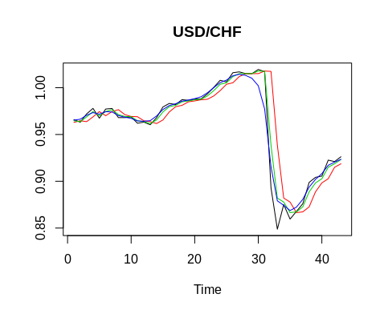
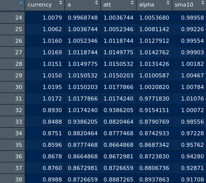
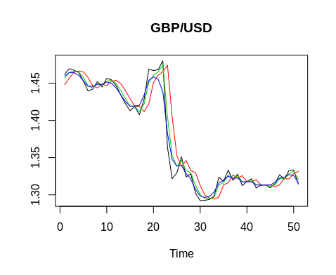
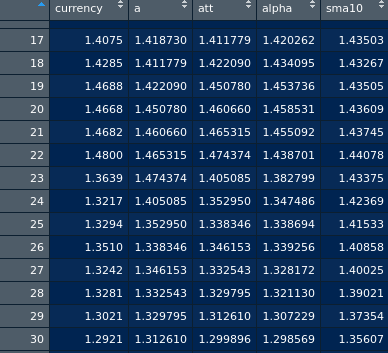

[Home](https://mgcodesandstats.github.io/) |
[Time Series Consulting](https://mgcodesandstats.github.io/timeseriesconsulting/) |
[Portfolio](https://mgcodesandstats.github.io/portfolio/) |
[Terms and Conditions](https://mgcodesandstats.github.io/terms/) |
[E-mail me](mailto:michael@michaeljgrogan.com)

# Kalman Filter: Modelling Time Series Shocks with KFAS

When it comes to time series forecasts, conventional models such as ARIMA are often a popular option. While these models can prove to have high degrees of accuracy, they have one major shortcoming – they do not typically account for “shocks”, or sudden changes in a time series. Let’s see how we can potentially alleviate this problem using a model known as the Kalman Filter.

## Time Series Shocks

Let’s take the currency market as an example. An currency pair could have an overall upward trend, and then spike sharply downwards during a sell-off. A conventional time series model wouldn’t necessarily account for this right away, and it would likely take several periods into the future before the sudden change in trend would be taken into account.

Therefore, we wish to use a time series model that is indeed capable of accounting for such shocks. Let’s take a look at a handy model known as the Kalman Filter.

The Kalman Filter is a state-space model that adjusts more quickly for shocks to a time series. Let’s see how this works using an example.

In January 2015, currency markets underwent one of the biggest shocks ever endured, when the Swiss National Bank decided to depeg the Swiss franc from the euro. As a result, the Swiss franc soared in value while other major currencies plummeted.

Let’s see how the Kalman Filter adjusts for such a shock.

## Kalman Filter with KFAS library: USD/CHF

Firstly, let’s download data for USD/CHF for the month of January 2015:
```
> require(Quandl)
Loading required package: Quandl
Loading required package: xts
Loading required package: zoo

Attaching package: ‘zoo’

The following objects are masked from ‘package:base’:

    as.Date, as.Date.numeric

> currency = Quandl("FRED/DEXSZUS", start_date="2010-01-01",end_date="2018-09-29",type="xts")
> currency=data.frame(currency)
> currency=(log(currency$currency))
```
We are converting the currency data into a data frame, and then converting into log format to structure our time series in terms of returns.

Now, we will attempt to model this time series with the Kalman Filter using the KFAS library.
```
> #Kalman Filter
> library(KFAS)
Warning message:
package ‘KFAS’ was built under R version 3.5.1 
> logmodel <- SSModel(currency ~ SSMtrend(1, Q = 0.01), H = 0.01)
> out <- KFS(logmodel)
> ts.plot(ts(exp(currency[1232:1274]), exp(out$a[1232:1274]), exp(out$att[1232:1274]), exp(out$alpha[1232:1274])
> title("USD/CHF")
```
Let’s go through the above.

SSModel denotes “state space model”, and observe that we are regressing the USD/CHF time series against the SSMtrend, which denotes our smoothed estimates, or state predictions one-step ahead of that of the actual series.

Q and H denote our unconstrained time-invariant covariance estimates. The steps to estimate these can be quite complex, so for our purposes I’m going to set these to a default value of 0.01.

When we plot our time series, here is what we come up with:



We can see that our a, att, and alpha series are adjusting to the shock instantaneously.

    a: One-step-ahead predictions of states
    att: Filtered estimates of states
    alphahat: Smoothed estimates of states

For comparison purposes, we will also compute a 10-day moving average to compare smoothing performance with that of the Kalman Filter.
```
library(TTR)
sma10=data.frame(SMA(exp(currency),n=10))
col_headings<-c("sma10")
names(sma10)<-col_headings
View(sma10)
```
Let’s now combine the above into a data frame along with our original series and see what we come up with:
```
> df<-data.frame(exp(currency[1232:1274]), exp(out$a[1232:1274]), exp(out$att[1232:1274]), exp(out$alpha[1232:1274]),sma10$sma10[1232:1274])
> View(df)
> col_headings<-c("currency","a","att","alpha","sma10")
> names(df)<-col_headings
> View(df)
```
Here is the data frame generated:



As elaborated in this post on Quora, there are some instances in which high-frequency data – or filtering to extract information from a noisy signal and predict the future state, is the most appropriate use of the Kalman Filter. On the other hand, smoothing relies more on past data, since there are some instances where averaging recent measurements may prove more accurate than using the most recent one.

In this particular instance, we can see that at time period 31 (which was one day before the sharp fall in the USD/CHF), the value of alpha (the smoothing estimate of state) dropped significantly from 1.002 to 0.97, and then down to 0.915 on the day of the actual shock.

This makes sense intuitively, as the currency was trading at a level of 0.9658 roughly one month prior. In this regard, the smoothing estimator allowed for a better prediction of the signal than using the filtering estimate a, which did not adjust for the shock until time period 33.

Additionally, notice that a 10-day SMA is also being used. Even though alpha is being used as a smoother, we see that alpha still adjusted for the shock much quicker than the simple moving average – meaning that the Kalman Filter has given a better prediction than simply using a basic smoothing technique.

## Another Example: GBP/USD

So, we’ve seen how the Kalman Filter adjusted to the sudden movement in the USD/CHF. Let’s take another example of a currency shock. When Britain voted for “Brexit” in June 2016, we saw the GBP/USD subsequently plunge.

How well would the Kalman Filter have modelled this? Let’s find out!

As in the example of USD/CHF, we download our GBP/USD data from Quandl and run the Kalman Filter:
```
require(Quandl)
library(KFAS)

gbpusd = Quandl("FRED/DEXUSUK", start_date="2016-01-01",end_date="2016-12-31",type="xts")
gbpusd=data.frame(gbpusd)
gbpusd=(log(gbpusd$gbpusd))

logmodel <- SSModel(gbpusd ~ SSMtrend(1, Q = 0.01), H = 0.01)
out <- KFS(logmodel)

df<-data.frame(exp(currency[100:150]), exp(out$a[100:150]), exp(out$att[100:150]), exp(out$alpha[100:150]),sma10$sma10[100:150])
View(df)
col_headings<-c("currency","a","att","alpha")
names(df)<-col_headings
View(df)
ts.plot(ts(exp(currency[100:150])), exp(out$a[100:150]), exp(out$att[100:150]), exp(out$alpha[100:150]), col = 1:4)
title("GBP/USD")
```
Here is a plot of our data. Again, we see that alpha adjusts downwards to a level of 1.438 one day before the shock at t=22:



Here are the a, att, and alpha statistics:



Again, we see that the 10-day SMA takes nearly 10 days to adjust fully for the shock, indicating once again that the smoothing parameter alpha has still proven superior in adjusting for the large change in the currency level.

## Conclusion

Here, it has been illustrated:

    The importance of adjusting for time series shocks
    How to implement a Kalman Filter using KFAS in R
    How to interpret output from a Kalman Filter
    Why the Kalman Filter is a suitable model for modelling time-series shocks
